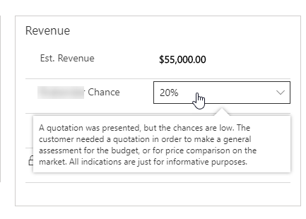

# OptionSet with Description Tool Tips PCF

A PCF control that displays a tooltip based on the Option Set description text.

######
This uses the OOB description field for Option Set values to display a tooltip when you hover over an option set value.

This is extremely useful for users to understand the definition of the value and provide business guidance on when it should be used.

